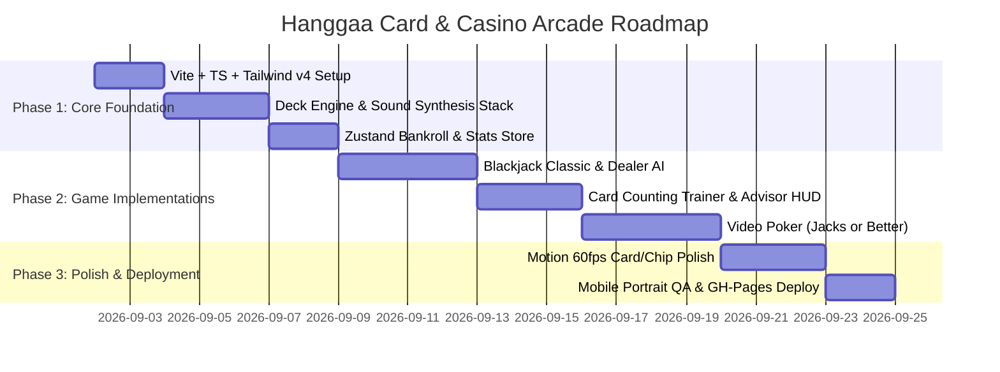

# Deep Research: Hanggaa Card & Casino Arcade

## 1. Project Name
**Hanggaa Card & Casino Arcade** (`hanggaa-games`)  
*A sleek, zero-cost, client-side solo card & casino web game hub built for mobile portrait and desktop play, deployed on GitHub Pages at `games.hanggaa.xyz`.*

---

## 2. Core Concept

### 2.1 Problem & Motivation
When looking for a quick, entertaining mental break during downtime, modern mobile and web card games suffer from severe friction:
- Heavy login/authentication requirements.
- Aggressive paywalls, microtransactions, and spammy video ads.
- Predatory real-money gambling mechanics.
- Clunky landscape-only interfaces that require two hands and phone rotation.
- Overcomplicated multiplayer matchmaking when the player only wants a solo session against smart bots.

### 2.2 Solution
Hanggaa Card & Casino Arcade is a **100% free, zero-friction, single-player card arcade** accessible instantly in any browser without login. It offers:
- **Instant Playability:** Opens in milliseconds, directly into the game lobby or table.
- **Shared Virtual Bankroll:** Risk-free virtual chips persisted locally in browser storage (`localStorage`), giving the authentic excitement of bankroll management without monetary risk.
- **Strategy & Skill Training:** Beyond casual entertainment, it includes a **Blackjack Card Counting Trainer** (Hi-Lo system with real-time Running Count & True Count calculation and Basic Strategy advisor) and **Poker / Video Poker** to sharpen probability calculation skills.
- **Future Roguelike Deckbuilder (Balatro-lite):** A roadmap expansion introducing poker-hand multipliers, jokers, and escalating blinds.

### 2.3 Aesthetic & Design Direction (Anti-Slop Directives)
In accordance with `design-taste-frontend`:
- **Design Read:** Solo Card & Casino Arcade web app for mobile portrait & desktop, with a **Cold Luxury / Deep Emerald Felt** visual language, powered by React + TypeScript + Tailwind CSS v4 + Motion (`motion/react`) + Phosphor Icons.
- **Design Dials:** `DESIGN_VARIANCE: 7` | `MOTION_INTENSITY: 6` | `VISUAL_DENSITY: 4`.
- **Color Calibration:** Cold Luxury theme—deep casino emerald green (`#062316` / `#0a3321`) and slate-950 backdrop, champagne gold accents (`#d4af37`), crisp monochrome borders (`white/10`), strictly avoiding generic purple/blue AI gradient clichés.
- **Mobile Portrait Ergonomics:** 100% playable with one thumb in vertical orientation. Fixed bottom betting & action sheets, dynamic stack heights, and `min-h-[100dvh]` viewport stability (zero layout jump on iOS Safari).

---

## 3. Target Users

### 3.1 Primary Persona: The Solo Strategy Enthusiast
- **Context:** Looking for a 2–10 minute engaging mental break while commuting, waiting, or relaxing.
- **Device Usage:** 80% smartphone (portrait mode, one-handed grip) and 20% desktop browser.
- **Key Desires:**
  - Fast, responsive interface with tactile click/haptic-like feedback.
  - Satisfying, realistic animations for dealing cards and stacking chips.
  - Crisp audio feedback (card flips, chip clinks) that feels like a real casino table.
  - Clear feedback on strategic decisions (evaluating whether a Hit/Stand/Split was mathematically optimal).

---

## 4. Technical Decisions & Architecture

### 4.1 Recommended Tech Stack
| Layer | Choice | Rationale & Trade-offs |
| :--- | :--- | :--- |
| **Framework** | **React 19 + TypeScript + Vite** | Blazing-fast HMR, tiny production bundle (<150kB gzipped), strict type safety for card state machines. |
| **Styling** | **Tailwind CSS v4** | Zero runtime overhead, clean utility classes, custom design tokens for felt textures and chip themes. |
| **Animation** | **Motion (`motion/react`)** | Hardware-accelerated GPU animations (`transform`, `opacity`) for 60fps card dealing, flipping, and chip sliding without layout thrashing. |
| **Icons** | **`@phosphor-icons/react`** | High-precision icon family (thin/bold/fill variants) matching casino luxury UI. |
| **Audio** | **Synthesized Web Audio API** | Zero-latency, zero asset loading failures, 100% offline procedural audio generation for card slides, chip clinks, and win fanfares. |
| **State & Store** | **Zustand + `persist` middleware** | Minimal boilerplate, atomic state updates, automatic serialization to `localStorage` for bankroll and game statistics. |
| **Deployment** | **GitHub Pages + `gh-pages`** | 100% free static hosting, automated build/deploy script, custom domain support for `games.hanggaa.xyz`. |

---

### 4.2 Core Algorithms & Game Logic

#### A. Card Deck & Shoe Engine
- **Standard 52-Card Deck:** 4 suits (`spades`, `hearts`, `diamonds`, `clubs`) and 13 ranks (`2`–`10`, `J`, `Q`, `K`, `A`).
- **Fisher-Yates Shuffle Algorithm:** Cryptographically unbiased O(n) in-place shuffling using `crypto.getRandomValues()` for provably fair random distribution.
- **Shoe Management:** Configurable 1 to 8 decks with a virtual "cut card" penetration indicator (typically reshuffling at 75% shoe depth).

```typescript
export interface Card {
  suit: 'spades' | 'hearts' | 'diamonds' | 'clubs';
  rank: '2'|'3'|'4'|'5'|'6'|'7'|'8'|'9'|'10'|'J'|'Q'|'K'|'A';
  value: number; // 2-10, 10 for J/Q/K, 1 or 11 for Ace
  id: string;    // unique instance identifier
}

export function createShoe(deckCount = 6): Card[] {
  const suits = ['spades', 'hearts', 'diamonds', 'clubs'] as const;
  const ranks = ['2','3','4','5','6','7','8','9','10','J','Q','K','A'] as const;
  const shoe: Card[] = [];

  for (let d = 0; d < deckCount; d++) {
    for (const suit of suits) {
      for (const rank of ranks) {
        let value = parseInt(rank, 10);
        if (['J', 'Q', 'K'].includes(rank)) value = 10;
        if (rank === 'A') value = 11;
        shoe.push({ suit, rank, value, id: `${d}-${suit}-${rank}` });
      }
    }
  }
  return shuffleDeck(shoe);
}

export function shuffleDeck(deck: Card[]): Card[] {
  const array = [...deck];
  for (let i = array.length - 1; i > 0; i--) {
    const randomBuffer = new Uint32Array(1);
    crypto.getRandomValues(randomBuffer);
    const j = randomBuffer[0] % (i + 1);
    [array[i], array[j]] = [array[j], array[i]];
  }
  return array;
}
```

---

#### B. Blackjack Engine & Card Counting Trainer
1. **Blackjack Standard Vegas Rules:**
   - Dealer hits on soft 17 (or configurable S17/H17).
   - Natural Blackjack pays 3:2.
   - Player actions: **Hit**, **Stand**, **Double Down**, **Split** (if matching rank), and **Insurance** (if Dealer shows Ace).
2. **Hi-Lo Card Counting Mathematics:**
   - **Card Values:** `2–6` = `+1` (Low cards, good for player when removed), `7–9` = `0` (Neutral), `10–A` = `-1` (High cards).
   - **Running Count (RC):** Sum of Hi-Lo values of all revealed cards since last shuffle.
   - **True Count (TC):** $\text{TC} = \frac{\text{Running Count}}{\text{Decks Remaining}}$. (Rounded to nearest half/full integer).
3. **Basic Strategy Advisor:**
   - Lookup matrix indexing `(Player Hand Total, Is Soft/Hard/Pair, Dealer Upcard) -> [H, S, D, P]`.
   - Real-time advisor mode: Shows green checkmark if user made the mathematically optimal move or gentle feedback if suboptimal.

---

#### C. Poker Hand Evaluator & AI Bot Engine
1. **Evaluator Strategy:**
   - For 5-card hands (Video Poker / Jacks or Better): Fast pattern matching (Frequency histogram of ranks + suit match check).
   - For 7-card hands (Texas Hold'em showdown): Integration of lightweight perfect-hash evaluator (`@pokertools/evaluator`) capable of evaluating 17M+ combinations/sec.
2. **Video Poker Paytable (Full Pay 9/6 Jacks or Better):**
   - Royal Flush (800x), Straight Flush (50x), Four of a Kind (25x), Full House (9x), Flush (6x), Straight (4x), Three of a Kind (3x), Two Pair (2x), Jacks or Better (1x).
3. **Texas Hold'em Solo AI:**
   - Tiered bot heuristics (Conservative, Aggressive, Balanced) calculating pot odds vs hand strength metric to simulate authentic heads-up / 4-max solo table action.

---

### 4.3 Audio Engineering with Web Audio API
Rather than relying on static `.mp3` files (which cause network latency and 404 bugs on GitHub Pages), we implement a **pure procedural Web Audio synthesizer**:
- **Card Slide / Deal:** White noise buffer passed through a high-Q bandpass filter (1.8 kHz) with an exponential gain decay (60ms).
- **Chip Clink:** Two short sine wave oscillators (2.4 kHz + 3.8 kHz) with ceramic frequency modulation and snappy envelope (35ms).
- **Win Fanfare / Chime:** Polyphonic major triad arpeggio (C5 - E5 - G5 - C6) synthesized with bell harmonics.
- **Button Click / Tap:** Crisp 120Hz transient pulse for haptic sensation.

```typescript
// Lightweight, zero-dependency sound synthesizer
class SoundEngine {
  private ctx: AudioContext | null = null;

  private getContext() {
    if (!this.ctx) {
      this.ctx = new (window.AudioContext || (window as unknown as { webkitAudioContext: typeof AudioContext }).webkitAudioContext)();
    }
    if (this.ctx.state === 'suspended') {
      this.ctx.resume();
    }
    return this.ctx;
  }

  playCardDeal() {
    const ctx = this.getContext();
    const bufferSize = ctx.sampleRate * 0.05;
    const buffer = ctx.createBuffer(1, bufferSize, ctx.sampleRate);
    const data = buffer.getChannelData(0);
    for (let i = 0; i < bufferSize; i++) {
      data[i] = Math.random() * 2 - 1;
    }

    const noise = ctx.createBufferSource();
    noise.buffer = buffer;
    const filter = ctx.createBiquadFilter();
    filter.type = 'bandpass';
    filter.frequency.setValueAtTime(2000, ctx.currentTime);
    filter.Q.setValueAtTime(3, ctx.currentTime);

    const gain = ctx.createGain();
    gain.gain.setValueAtTime(0.3, ctx.currentTime);
    gain.gain.exponentialRampToValueAtTime(0.001, ctx.currentTime + 0.05);

    noise.connect(filter);
    filter.connect(gain);
    gain.connect(ctx.destination);
    noise.start();
  }

  playChipClink() {
    const ctx = this.getContext();
    const osc = ctx.createOscillator();
    const gain = ctx.createGain();
    osc.type = 'sine';
    osc.frequency.setValueAtTime(2800, ctx.currentTime);
    osc.frequency.exponentialRampToValueAtTime(800, ctx.currentTime + 0.04);
    gain.gain.setValueAtTime(0.25, ctx.currentTime);
    gain.gain.exponentialRampToValueAtTime(0.001, ctx.currentTime + 0.04);

    osc.connect(gain);
    gain.connect(ctx.destination);
    osc.start();
    osc.stop(ctx.currentTime + 0.04);
  }
}
export const soundFx = new SoundEngine();
```

---

### 4.4 Mobile-First Portrait UI & Layout Hierarchy

```
┌────────────────────────────────────────┐
│ [≡ Menu/Lobby]   [Bankroll: $1,250 🪙]  │ Header Bar (Sticky)
├────────────────────────────────────────┤
│                                        │
│             DEALER FELT AREA           │ Top Section
│           [ 🂠 Dealer: 16 (Soft) ]      │ Card reveal & count
│                                        │
├────────────────────────────────────────┤
│                                        │
│          CARD COUNTING HUD             │ Middle Section (Toggleable)
│       [ RC: +4 | TC: +2.1 | True ]      │ Basic Strategy Advice
│                                        │
├────────────────────────────────────────┤
│                                        │
│             PLAYER HAND                │ Player Zone
│          [ 🂡 ] [ 🂧 ] = 18 (Soft)       │ Dynamic card fan/stack
│           Current Bet: $50 🪙          │
│                                        │
├────────────────────────────────────────┤
│   [ +5 ]   [ +25 ]   [ +100 ]   [ +500]│ Chip Selector Sheet
├────────────────────────────────────────┤
│  [ DOUBLE ]   [ HIT ]   [ STAND ]      │ Main Thumb Action Bar
│   (Pill)      (Solid)   (Outline)      │ Fixed Bottom Sheet (1-Hand)
└────────────────────────────────────────┘
```

---

### 4.5 GitHub Pages & Custom Domain Deployment Configuration

1. **Custom Domain:** `games.hanggaa.xyz`
2. **Vite Config (`vite.config.ts`):**
   ```typescript
   import { defineConfig } from 'vite';
   import react from '@vitejs/plugin-react';
   import tailwindcss from '@tailwindcss/vite';

   export default defineConfig({
     plugins: [react(), tailwindcss()],
     base: '/', // Custom domains use root path '/'
   });
   ```
3. **CNAME File:**
   - Placed in `public/CNAME` containing single line: `games.hanggaa.xyz`.
4. **Deploy Script in `package.json`:**
   ```json
   {
     "scripts": {
       "dev": "vite",
       "build": "tsc -b && vite build",
       "deploy": "gh-pages -d dist"
     }
   }
   ```

---

## 5. Competitor Insights & Differentiation

| Platform | Strengths | Major Flaws & Annoyances | How Hanggaa Arcade Exploits the Gap |
| :--- | :--- | :--- | :--- |
| **Zynga Poker** | High visual polish, active sound effects | Heavy loading, aggressive microtransactions, slow multiplayer matchmaking, required logins | Instant launch in <1s, 100% free virtual chips with zero paywalls, instant solo bots |
| **App Store Blackjack Trainers** | Good card counting drills | Outdated early-2000s graphics, full of fullscreen video ads, rigid landscape layouts | Sleek luxury emerald UI, one-handed mobile portrait design, zero ads, runs anywhere in browser |
| **Balatro** | Deeply satisfying roguelike poker mechanics | Paid standalone game on Steam/Consoles, complex setup | Inspires the Phase 2 "Balatro-lite" mode directly playable in a lightweight browser tab |

---

## 6. Budget & Roadmap Timeline

### 6.1 Cost Breakdown: $0.00 (100% Free Forever)
- **Hosting & CDN:** GitHub Pages ($0/mo)
- **Domain:** `hanggaa.xyz` (Already owned sub-domain setup)
- **Database / Backend:** Client-side `localStorage` ($0/mo)
- **Audio & Assets:** Procedural Web Audio API + Phosphor SVGs ($0/mo)

### 6.2 Implementation Roadmap (2–3 Weeks)



---

## Handoff Context
<!-- Machine-readable summary for the next workflow step. Do not delete; the next prompt in the workflow reads this block. -->
- Stage: research
- App name: hanggaa-games
- User level: C
- Target platform: web
- Budget: free
- Timeline: few weeks
- Source files: research-hanggaa-games.md
---
